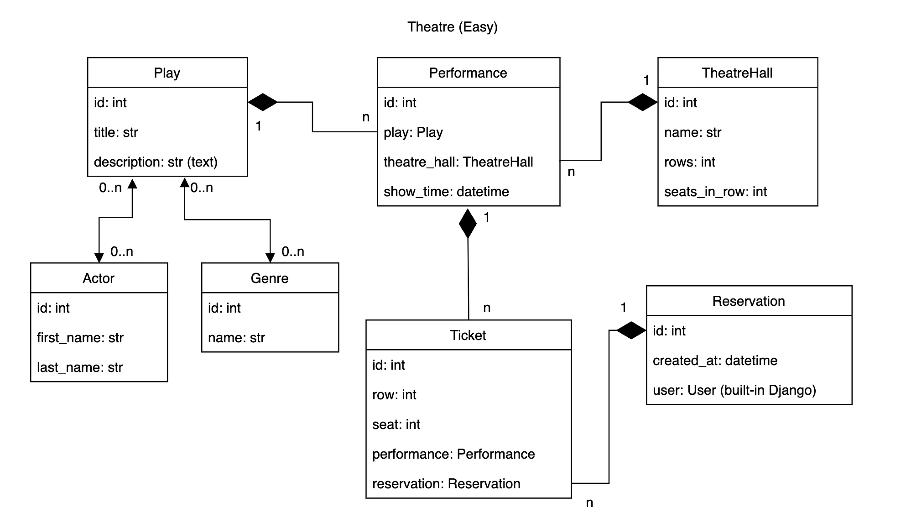

# Theatre API

API for managing ticket bookings for theatre service built with DRF.

## Database Structure


## Features
- JWT Authentication
- Admin panel /admin
- Creating reservations (buying tickets)

## Installation

1. Clone the repository
    ```bash
    git clone https://github.com/dimashevchukk/theatre-api
    cd theatre-api
2. Install requirements
   ```bash
   pip install -r requirements.txt
3.Create environment variables file  
Create a .env file in the root directory and configure it like in .env.example

4.Build and run with Docker
   ```bash
   docker-compose build
   docker-compose up
